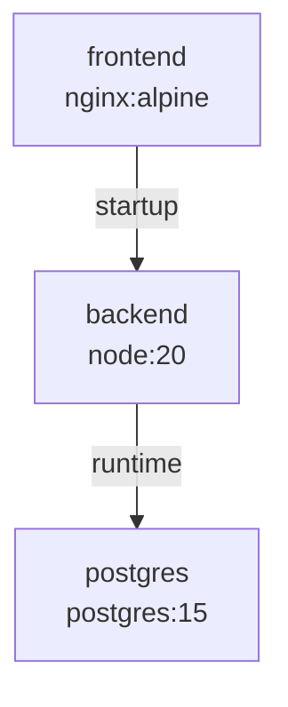
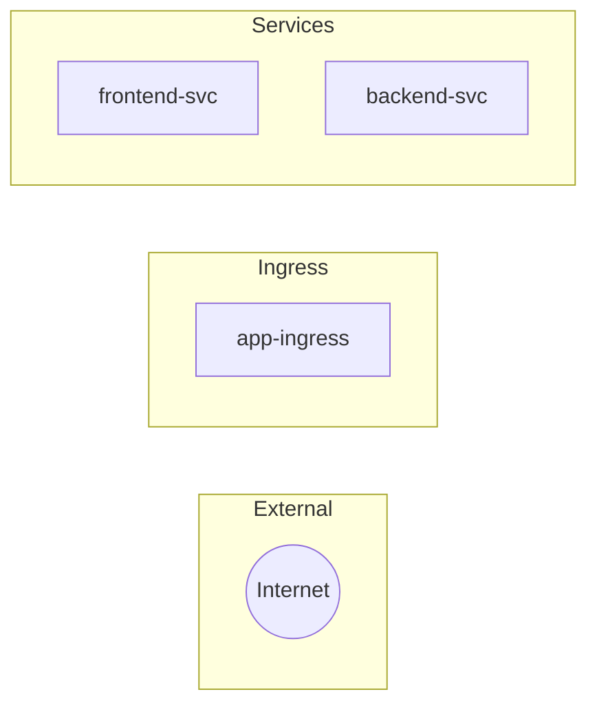
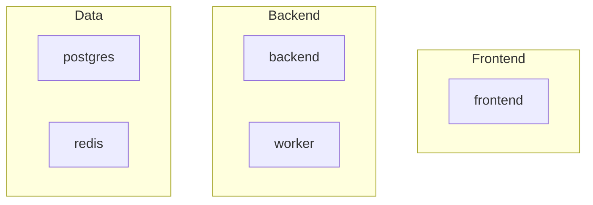

# Analysis Engine

This document explains how CloudGraph analyzes parsed resources, builds dependency graphs, detects risks, and generates recommendations.

---

## Analysis Pipeline

```
┌─────────────────────────────────────────────────────────────────┐
│                     Input: Resources + Dependencies              │
└────────────────────────────────┬────────────────────────────────┘
                                 │
                                 ▼
┌─────────────────────────────────────────────────────────────────┐
│              1. Resolve Selector Dependencies                    │
│                 (K8s Service → Pod matching)                     │
└────────────────────────────────┬────────────────────────────────┘
                                 │
                                 ▼
┌─────────────────────────────────────────────────────────────────┐
│              2. Infer Additional Dependencies                    │
│                 (from environment variables)                     │
└────────────────────────────────┬────────────────────────────────┘
                                 │
                                 ▼
┌─────────────────────────────────────────────────────────────────┐
│              3. Build Dependency Graph                           │
│                 (nodes + edges structure)                        │
└────────────────────────────────┬────────────────────────────────┘
                                 │
        ┌────────────────────────┼────────────────────────┐
        ▼                        ▼                        ▼
┌───────────────┐    ┌───────────────────┐    ┌──────────────────┐
│ 4. Generate   │    │ 5. Detect Risks   │    │ 6. Generate      │
│ Mermaid       │    │                   │    │ Recommendations  │
│ Diagrams      │    │                   │    │                  │
└───────────────┘    └───────────────────┘    └──────────────────┘
        │                        │                        │
        └────────────────────────┼────────────────────────┘
                                 │
                                 ▼
┌─────────────────────────────────────────────────────────────────┐
│                    Output: AnalysisResult                        │
└─────────────────────────────────────────────────────────────────┘
```

---

## 1. Selector Resolution

### Purpose

Kubernetes Services use label selectors to target Pods. The parser creates placeholder dependencies like `selector:{"app":"backend"}`, which must be resolved to actual resource IDs.

### Algorithm

```typescript
function resolveSelectorDependencies(
    dependencies: Dependency[],
    resources: Resource[]
): Dependency[] {
    const resolved: Dependency[] = [];

    for (const dep of dependencies) {
        if (dep.type === 'selector' && dep.target.startsWith('selector:')) {
            // Parse the selector JSON
            const selectorJson = dep.target.replace('selector:', '');
            const selector = JSON.parse(selectorJson);

            // Find matching resources
            for (const resource of resources) {
                if (matchesSelector(resource, selector)) {
                    resolved.push({
                        ...dep,
                        id: uuidv4(),
                        target: resource.id,
                        reason: `Selector match: ${JSON.stringify(selector)}`
                    });
                }
            }
        } else {
            resolved.push(dep);
        }
    }

    return resolved;
}
```

### Selector Matching

```typescript
function matchesSelector(resource: Resource, selector: Record<string, string>): boolean {
    if (!resource.labels) return false;

    for (const [key, value] of Object.entries(selector)) {
        if (resource.labels[key] !== value) {
            return false;
        }
    }
    return true;
}
```

---

## 2. Dependency Inference

### Purpose

Detect implicit dependencies from environment variables that reference other services.

### Patterns Detected

| Pattern | Inferred Type | Service Name |
|---------|---------------|--------------|
| `POSTGRES_*`, `POSTGRESQL_*` | database | PostgreSQL |
| `MYSQL_*`, `MARIADB_*` | database | MySQL |
| `MONGO_*`, `MONGODB_*` | database | MongoDB |
| `REDIS_*` | cache | Redis |
| `RABBITMQ_*`, `AMQP_*` | message-broker | RabbitMQ |
| `KAFKA_*` | message-broker | Kafka |
| `ELASTICSEARCH_*` | search | Elasticsearch |

### Algorithm

```typescript
function inferDependencies(
    resources: Resource[],
    existing: Dependency[]
): Dependency[] {
    const inferred: Dependency[] = [];

    for (const resource of resources) {
        if (!resource.metadata.environment) continue;

        for (const env of resource.metadata.environment) {
            const envString = `${env.name}=${env.value || ''}`;

            for (const pattern of patterns) {
                if (pattern.regex.test(envString)) {
                    // Find matching service
                    const matchingService = resources.find(r =>
                        r.name.toLowerCase().includes(pattern.name.toLowerCase()) ||
                        r.metadata.image?.toLowerCase().includes(pattern.name.toLowerCase())
                    );

                    if (matchingService && matchingService.id !== resource.id) {
                        inferred.push({
                            id: uuidv4(),
                            source: resource.id,
                            target: matchingService.id,
                            type: 'runtime',
                            isInferred: true,
                            confidence: 'medium',
                            reason: `Inferred from env: ${env.name}`
                        });
                    }
                }
            }
        }
    }

    return inferred;
}
```

---

## 3. Dependency Graph Building

### Node Structure

```typescript
interface GraphNode {
    id: string;
    label: string;         // Resource name
    type: ResourceKind;    // Deployment, Service, etc.
    platform: Platform;    // docker-compose | kubernetes
    group?: string;        // frontend | backend | data | infra
    namespace?: string;
    properties: {
        image?: string;
        replicas?: number;
        ports?: PortMapping[];
        sourceFile?: string;
    };
}
```

### Edge Structure

```typescript
interface GraphEdge {
    id: string;
    source: string;        // Source resource ID
    target: string;        // Target resource ID
    type: DependencyType;  // network, startup, config, etc.
    isInferred: boolean;   // Was this inferred?
    confidence?: string;   // high | medium | low
    label?: string;
}
```

### Resource Categorization

Resources are grouped into logical categories for visualization:

```typescript
function categorizeResource(resource: Resource): string {
    const name = resource.name.toLowerCase();
    const image = resource.metadata.image?.toLowerCase() || '';

    // Frontend indicators
    if (name.includes('frontend') || name.includes('ui') || 
        image.includes('nginx') || image.includes('react')) {
        return 'frontend';
    }

    // Data layer
    if (name.includes('postgres') || name.includes('redis') ||
        image.includes('postgres') || image.includes('redis')) {
        return 'data';
    }

    // Infrastructure
    if (resource.kind === 'Ingress' || resource.kind === 'Service') {
        return 'infra';
    }

    return 'backend';
}
```

---

## 4. Mermaid Diagram Generation

Three diagram types are generated:

### Container View

Shows all container workloads and their dependencies:



### Service View

Shows the service mesh with ingress, services, and workloads:



### Infrastructure View

Groups resources by category (frontend, backend, data, infra):



---

## 5. Risk Detection

### Risk Categories

| Category | Checks |
|----------|--------|
| **Availability** | Single replica workloads |
| **Reliability** | Missing health checks |
| **Resource Management** | Missing CPU/memory limits |
| **Cleanup** | Orphaned ConfigMaps/Secrets |

### Risk Detection Rules

```typescript
function detectRisks(resources: Resource[], dependencies: Dependency[]): RiskAssessment[] {
    const risks: RiskAssessment[] = [];

    for (const resource of resources) {
        // Single replica check
        if (['Deployment', 'StatefulSet'].includes(resource.kind)) {
            if (resource.metadata.replicas === 1) {
                risks.push({
                    id: uuidv4(),
                    severity: 'medium',
                    category: 'Availability',
                    title: 'Single Replica Workload',
                    description: `${resource.kind} "${resource.name}" has only 1 replica`,
                    affectedResources: [resource.id],
                    recommendation: 'Increase replicas to at least 2'
                });
            }
        }

        // Missing health check
        if (!resource.metadata.healthCheck) {
            risks.push({
                severity: 'medium',
                category: 'Reliability',
                title: 'Missing Health Checks',
                // ...
            });
        }
    }

    return risks;
}
```

### Severity Levels

| Level | Description |
|-------|-------------|
| `critical` | System may fail; immediate action required |
| `high` | Significant issue; address soon |
| `medium` | Potential problem; should be addressed |
| `low` | Minor concern; nice to fix |

---

## 6. Recommendation Generation

Recommendations are aggregated from individual risks:

```typescript
function generateRecommendations(risks: RiskAssessment[]): Recommendation[] {
    const recommendations: Recommendation[] = [];

    // Group risks by category
    const risksByCategory = groupBy(risks, 'category');

    if (risksByCategory['Availability']?.length > 0) {
        recommendations.push({
            id: uuidv4(),
            priority: 'high',
            category: 'Availability',
            title: 'Improve High Availability',
            description: `${count} workloads have single replicas...`,
            affectedResources: flatten(risks.map(r => r.affectedResources))
        });
    }

    return recommendations;
}
```

---

## Output Structure

```typescript
interface AnalysisResult {
    id: string;
    status: 'completed' | 'error';
    createdAt: string;
    completedAt: string;
    
    summary: {
        totalResources: number;
        byKind: Record<ResourceKind, number>;
        byPlatform: Record<Platform, number>;
        resources: Resource[];
    };
    
    graph: {
        nodes: GraphNode[];
        edges: GraphEdge[];
        metadata: GraphMetadata;
    };
    
    diagrams: {
        containerView: string;   // Mermaid code
        serviceView: string;
        infrastructureView: string;
    };
    
    analysis: {
        overview: string;        // Markdown text
        criticalPaths: CriticalPath[];
        logicalGroups: LogicalGroup[];
        externalDependencies: ExternalDependency[];
    };
    
    risks: RiskAssessment[];
    recommendations: Recommendation[];
    errors?: string[];
}
```

---

## Next Steps

- [Graph & Visualization](graph-and-visualization.md) - Frontend rendering
- [Architecture Overview](architecture-overview.md) - System design
